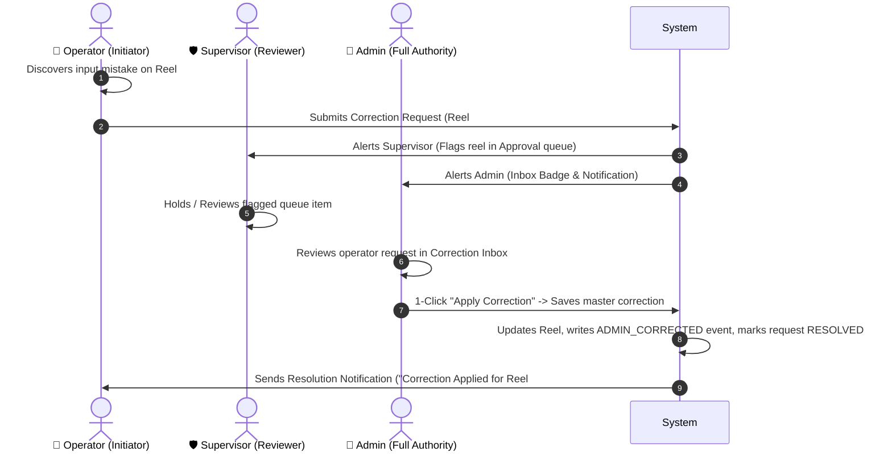

# Rainbow Packaging - Operator Correction Messaging System Architecture & Implementation Plan

> **Document Purpose**: Complete contextual brief and implementation specification for the Operator-to-Supervisor & Admin Correction Messaging feature. An AI agent can read this file directly to understand the full project structure, business rules, role boundaries, and code-level steps.

---

## 1. Project Overview & Tech Stack

* **Application**: Rainbow Packages — Industrial Paper Reel Inventory & Consumption Tracking System
* **Backend**: Node.js (ES Modules), Express.js, MongoDB Atlas (Mongoose ODM), Zod Validation, Winston Logger, JWT Auth.
  * Backend root: `backend/`
  * API prefix: `/api`
* **Frontend**: React 18, Vite, Tailwind CSS, Lucide Icons, Axios API Clients, Context API Auth.
  * Frontend root: `frontend/`

---

## 2. Core User Roles & Authority Matrix

| Role | System Role Name | Authority & Capabilities |
| :--- | :--- | :--- |
| **1. Initiator** | `OPERATOR` | • Creates reel inventory entries (subject to supervisor/admin confirmation).<br>• Records daily machine station weight consumption (E-Flute, Narrow-Flute, Sheater, etc.).<br>• **Correction Rights**: Cannot directly edit database records. Must send a **Correction Request Message** with Reel #, Master Code, and explanation if wrong inputs were submitted. |
| **2. Reviewer** | `SUPERVISOR` | • Reviews FIFO queue of reel creations and usage logs.<br>• Approves or Declines entries with reasons.<br>• Views operator correction requests and flagged reels to hold pending approvals. |
| **3. Full Authority** | `ADMIN` | • **Sole authority to execute corrections** on active reel specifications, weights, mill names, and master codes.<br>• Receives Operator Correction Requests, reviews requested values, and executes master corrections with 1 click.<br>• Full system management (Users, Settings, Digest, Master Codes). |

---

## 3. Existing Database Models & Context

1. **`Reel` (`backend/src/models/reel.model.js`)**:
   * `sr_no` (Number, unique auto-increment sequence)
   * `reel_no` (String, e.g. `"78"`, `"1094"`, `"R-1001"`)
   * `quality` (String, e.g. `"ULTRA"`, `"VK"`, `"SK"`, `"DCB"`, `"FBB"`, `"Spectra"`, `"SBS"`)
   * `bf` (Mixed: Number/String, e.g. `18`, `22`, `"ULTRA"`, `"DCB"`, `"FBB"`)
   * `gsm` (Mixed: Number/String, e.g. `220`, `140`, `100`, `180`)
   * `size` (Number, size in cm, e.g. `26`, `32.5`, `34`)
   * `max_weight` / `previous_weight` (Number, in kg)
   * `supplier_name` (String, e.g. `"Century Paper"`, `"Vishal Kraft"`, `"Shree Krishna"`)
   * `mill_name` (String, e.g. `"Century Paper Mill"`, `"VK Mill"`, `"SK Paper Mill"`, `"ITC Bhadrachalam"`)
   * `master_code` (String, e.g. `"1"`, `"6"`, `"19"`)
   * `master_code_id` (ObjectId ref `MasterCode`)
   * `master_key` (String, e.g. `"Duplex ultra 220-32.5"`)
   * `status` (`'REEL'`, `'CUT'`, `'NILL'`, `'VOIDED'`)
   * `record_status` (`'ACTIVE'`, `'ARCHIVED'`, `'VOIDED'`)

2. **`MasterCode` (`backend/src/models/masterCode.model.js`)**:
   * Holds predefined and custom master codes (1 to 25): e.g. `1: Duplex ultra 220`, `2: Duplex Ultra230/240`, `6: SK-16-100`, `11: VK-18-140`, `17: FBB`, `18: SBS`, `19: VK-22-220`, `21: SK-18-120`, etc.

3. **`ReelEvent` (`backend/src/models/reelEvent.model.js`)**:
   * Audit log for events: `CREATED`, `USAGE_LOGGED`, `CONFIRMED`, `DECLINED_REVERTED`, `ADMIN_CORRECTED`.

4. **`Notification` (`backend/src/models/notification.model.js`)**:
   * Real-time notifications for users (`user_id`, `type`, `title`, `message`, `is_read`, `data`).

---

## 4. Problem Statement & Workflow Requirements

### The Problem:
When an operator makes a mistake (e.g. enters `450 kg` instead of `540 kg`, selects wrong Master Code, enters wrong reel number or width), the operator cannot edit the saved record directly. 

### The Solution:
Provide an interactive **"Send Correction Message"** mechanism from the Operator interface:
1. Operator selects the reel and inputs the wrong vs. correct values, Master Code, and reason note.
2. System flags the reel in the Supervisor approval queue (preventing premature confirmation of erroneous data).
3. System sends an instant notification & inbox item to the Admin.
4. Admin opens the Correction Request, clicks **"Apply Correction"** (pre-populating the existing `MasterCorrectionModal`), and submits the correction.
5. The reel updates, an `ADMIN_CORRECTED` audit event is logged, the request is marked `RESOLVED`, and the Operator receives confirmation.

---

## 5. End-to-End Workflow Diagram



---

## 6. Detailed Implementation Specification

### Step 1: Backend Model `CorrectionRequest`
Create `backend/src/models/correctionRequest.model.js`:
```javascript
import mongoose from 'mongoose';

const correctionRequestSchema = new mongoose.Schema(
  {
    reel_id: { type: mongoose.Schema.Types.ObjectId, ref: 'Reel', required: true },
    reel_no: { type: String, required: true, trim: true },
    master_code_id: { type: mongoose.Schema.Types.ObjectId, ref: 'MasterCode', default: null },
    master_code: { type: String, trim: true, default: null },
    master_code_name: { type: String, trim: true, default: null },
    requested_by: { type: mongoose.Schema.Types.ObjectId, ref: 'User', required: true },
    requested_by_name: { type: String, required: true },
    requested_by_role: { type: String, required: true },
    category: {
      type: String,
      required: true,
      enum: ['WRONG_WEIGHT', 'WRONG_SPECS', 'WRONG_MASTER_CODE', 'WRONG_REEL_NO', 'WRONG_MILL_SUPPLIER', 'OTHER'],
      default: 'OTHER',
    },
    message: { type: String, required: true, trim: true },
    requested_changes: {
      previous_weight: { type: Number },
      max_weight: { type: Number },
      reel_no: { type: String },
      quality: { type: String },
      gsm: { type: mongoose.Schema.Types.Mixed },
      bf: { type: mongoose.Schema.Types.Mixed },
      size: { type: Number },
      supplier_name: { type: String },
      mill_name: { type: String },
      master_code: { type: String },
    },
    current_snapshot: { type: mongoose.Schema.Types.Mixed, default: {} },
    status: {
      type: String,
      required: true,
      enum: ['PENDING', 'RESOLVED', 'REJECTED'],
      default: 'PENDING',
    },
    resolved_by: { type: mongoose.Schema.Types.ObjectId, ref: 'User', default: null },
    resolved_by_name: { type: String, default: null },
    resolution_note: { type: String, default: null },
    resolved_at: { type: Date, default: null },
  },
  {
    timestamps: { createdAt: 'created_at', updatedAt: 'updated_at' },
    versionKey: false,
    toJSON: {
      transform: (_doc, ret) => {
        ret.id = ret._id.toString();
        delete ret._id;
        delete ret.__v;
        return ret;
      },
    },
  }
);

correctionRequestSchema.index({ status: 1, created_at: -1 });
correctionRequestSchema.index({ reel_id: 1, status: 1 });
correctionRequestSchema.index({ requested_by: 1, created_at: -1 });

export const CorrectionRequest = mongoose.model('CorrectionRequest', correctionRequestSchema);
```

---

### Step 2: Backend Notification Constants
Update `backend/src/constants/notificationTypes.js`:
```javascript
export const NOTIFICATION_TYPES = Object.freeze({
  ENTRY_DECLINED: 'ENTRY_DECLINED',
  CORRECTION_REQUESTED: 'CORRECTION_REQUESTED',
  CORRECTION_RESOLVED: 'CORRECTION_RESOLVED',
  CORRECTION_REJECTED: 'CORRECTION_REJECTED',
});
```

---

### Step 3: Backend Routes & Controller
Create `backend/src/routes/correction.routes.js` and `backend/src/controllers/correction.controller.js`:

| Method | Endpoint | Allowed Roles | Description |
| :--- | :--- | :--- | :--- |
| `POST` | `/api/corrections` | `OPERATOR`, `SUPERVISOR`, `ADMIN` | Submit correction request with reel details & note. |
| `GET` | `/api/corrections` | All Authenticated | List correction requests (filterable by `status`, `reel_no`, `page`, `limit`). |
| `GET` | `/api/corrections/:id` | All Authenticated | Get full details of a specific request. |
| `PATCH` | `/api/corrections/:id/resolve` | **`ADMIN` Only** | Execute correction, update Reel, log `ADMIN_CORRECTED` event, and mark request `RESOLVED`. |
| `PATCH` | `/api/corrections/:id/reject` | `ADMIN`, `SUPERVISOR` | Decline request with reason and notify operator. |

Register in `backend/src/routes/index.js`:
```javascript
import { correctionRouter } from './correction.routes.js';
// ...
router.use('/corrections', correctionRouter);
```

---

### Step 4: Frontend API Client
Create `frontend/src/api/correctionApi.js`:
```javascript
import api from './api';

export const correctionApi = {
  create: (data) => api.post('/corrections', data),
  list: (params) => api.get('/corrections', { params }),
  getById: (id) => api.get(`/corrections/${id}`),
  resolve: (id, payload) => api.patch(`/corrections/${id}/resolve`, payload),
  reject: (id, payload) => api.patch(`/corrections/${id}/reject`, payload),
  getPendingCount: () => api.get('/corrections/pending-count'),
};
```

---

### Step 5: Frontend UI Components

1. **`RequestCorrectionModal.jsx` (`frontend/src/pages/Reels/RequestCorrectionModal.jsx`)**:
   * Pre-fills selected Reel #, Master Code Name, Quality, GSM, BF, Size, Weight, Mill.
   * Input fields for operator to specify correct values.
   * Required reason / message text box.
   * Accessible via button on:
     * **Reel Detail Page** (`/reels/:id`)
     * **Reel Inventory Table row action**
     * **Operator Approvals / Submissions page**

2. **`CorrectionInboxPage.jsx` (`frontend/src/pages/Approvals/CorrectionInboxPage.jsx`)**:
   * Dedicated tab in Approvals or stand-alone message center.
   * Shows Pending, Resolved, and Rejected correction requests.
   * Side-by-side comparison: **Current Reel Specs vs. Operator Requested Correction**.
   * Admin-only **"Review & Apply"** button: Opens `MasterCorrectionModal` pre-populated with requested changes.

3. **`AppShell.jsx` (Navigation & Badging)**:
   * Displays badge count for active correction requests in sidebar and top navbar bell.
   * Operators see real-time updates when Admin approves or resolves their message.

---

## 7. Verification & Testing Checklist

- [ ] Operator submits correction request on Reel #78 with message: `"Weight was entered 406kg instead of 460kg"`.
- [ ] Database creates `CorrectionRequest` record with `status: 'PENDING'`.
- [ ] Supervisor sees flagged status on Reel #78 in Approvals list.
- [ ] Admin receives notification and sees pending badge count in header.
- [ ] Admin clicks "Apply Correction" &rarr; Reel is updated to 460kg with `EVENT_TYPES.ADMIN_CORRECTED`.
- [ ] Correction request transitions to `RESOLVED` with `resolved_by: admin._id`.
- [ ] Operator receives notification: `"Correction for Reel #78 has been applied by Admin"`.
- [ ] All audit trails (`ReelEvent`) accurately reference the correction event.

---
*Generated for Rainbow Packaging codebase.*
